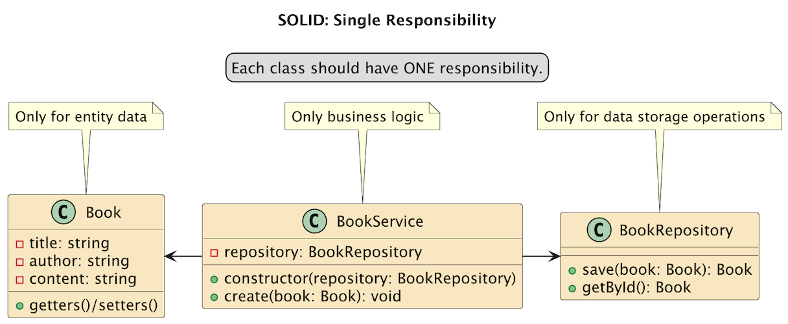
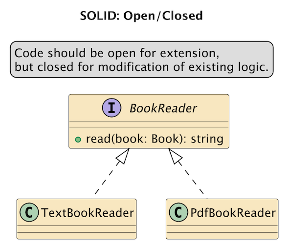
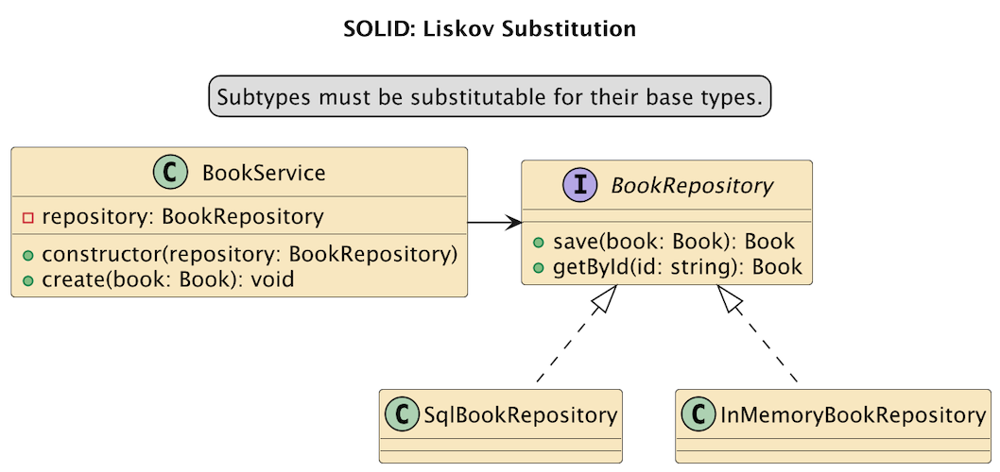
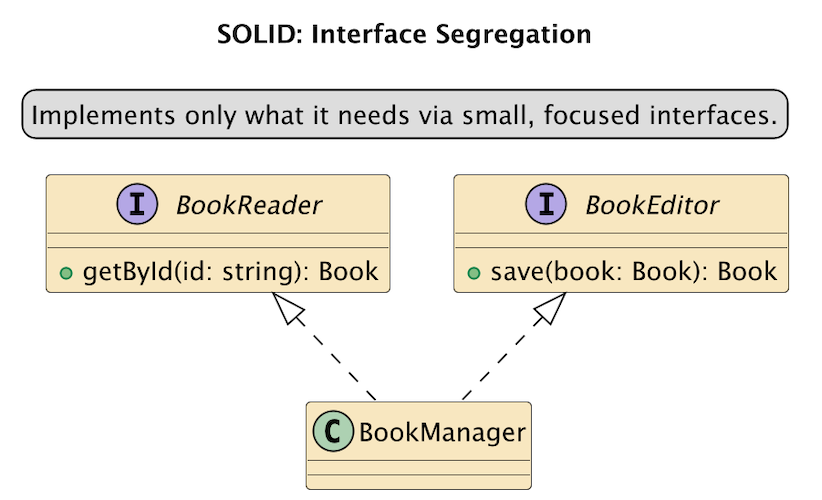
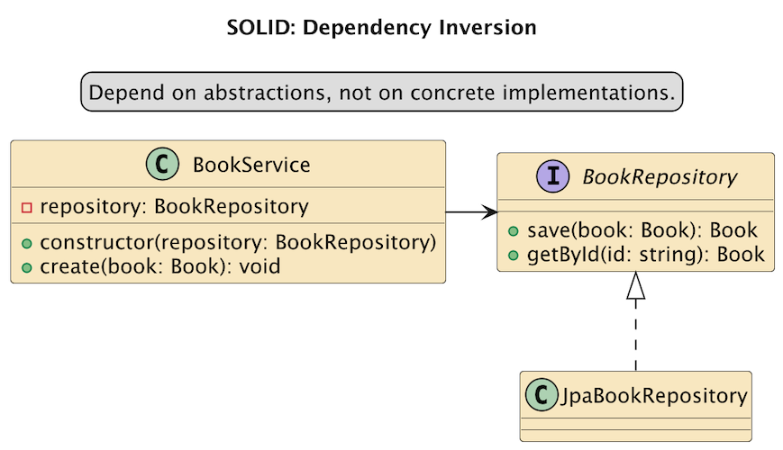
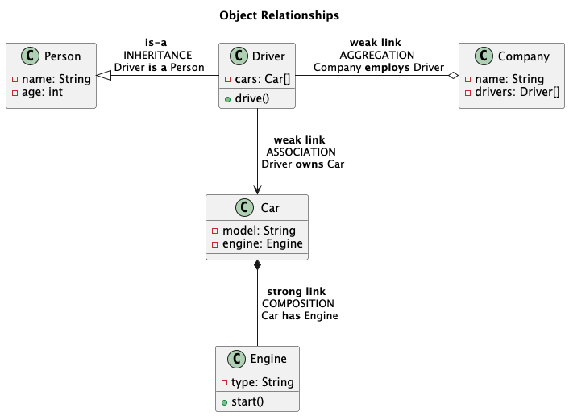

[Return to main README.md](../README.md#knowledge-base)

# OOP

## SOLID Principles

### Single Responsibility

### Open / Closed

### Liskov Substitution

### Interface Segregation

### Dependency Inversion

## Object Relationships

